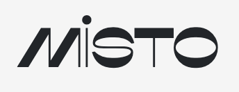
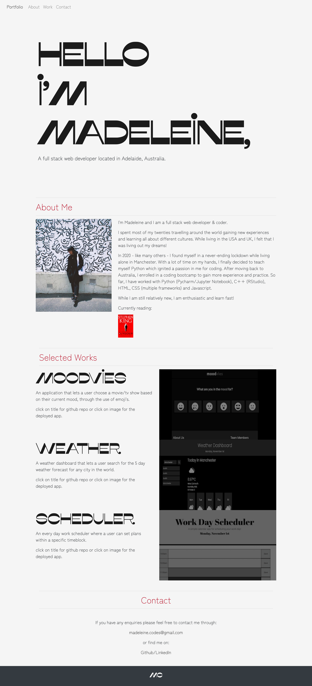

# Professional Portfolio

# Description
A professional portfolio is a great way to showcase your own work to future employers or customers. 

# User Story
```
AS AN employer
I WANT to view a potential employee's deployed portfolio of work samples
SO THAT I can review samples of their work and assess whether they're a good candidate for an open position.
```

# Mock Up
I designed and developed my responsive portfolio using HTML and Bootstrap 5.

I used the font type Misto (as shown below) for my main title and Zen Kaku Gothic Antique for the body of the page.



I went for a minimalist yet retro style and used the following colors for the body of my portfolio:


My new portfolio contains an about me section as well as a work section wherein I showcase my top 3 projects so far with links to both their github repos as well as their deployed pages.

I also added a contact section with a link directly to email as well as links to my main github and linkedin pages.

Below is my portfolio redo!



