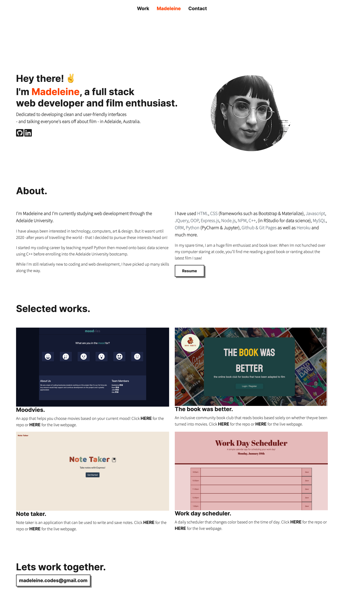

# Professional Portfolio

# Description
A professional portfolio is a great way to showcase your own work to future employers or customers. 

# User Story
```
AS AN employer
I WANT to view a potential employee's deployed portfolio of work samples
SO THAT I can review samples of their work and assess whether they're a good candidate for an open position.
```

# Mock Up
I designed and developed my responsive minimalistic portfolio using:
* HTML
* CSS
* Bootstrap 5 
* Javascript
* Font Awesome
* Google Fonts


I am a huge fan of minimalist and brutalist design styles which helped me in my choices with this simplistic portfolio.


Below is a screen capture of my full webpage!



And here is my portfolio in action!


The Links in the nav bar go to the work, about and contact sections respectively while i have also have clickable icons on my hero section that go directly to my github and linkedin pages.


I have added a button for a resume but I have chosen to not post my resume onto this site.


My work section contains images of each selected work along with links to their respetive repo's and live webpages.


Lastly, I have my email address at the bottom in the footer in case anyone would like to ask me anything code related!


# Credits
[Madeleine Cosway](https://github.com/madeleinesc)

